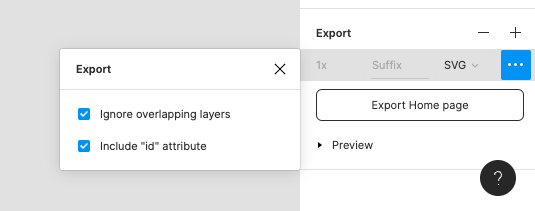

# Heist Example

This package includes builds of the heist example component, plus the tooling to generate it.

## Development

1. The source material is this [Figma document](https://www.figma.com/file/8Wq8gm6AeVSPx82sNt2hGF/Blueprint?type=design&node-id=0-1&mode=design&t=tiex9DnM6v8lQ2Hv-0). Select the component you want to to export (Usually the frame 'heist') from the hierarchy on the left, then select the export option from the design panel on the right (making sure to check 'ignore overlapping layers' and 'Include "id" attribute' as shown below.) 
2. Move the downloaded file into the 'assets' folder, with the matching filename (heist.svg).
3. Run the `yarn heist` command - this uses an [SVGR](https://react-svgr.com/) configuration to process the raw SVG into a React component that fits our requirements.

